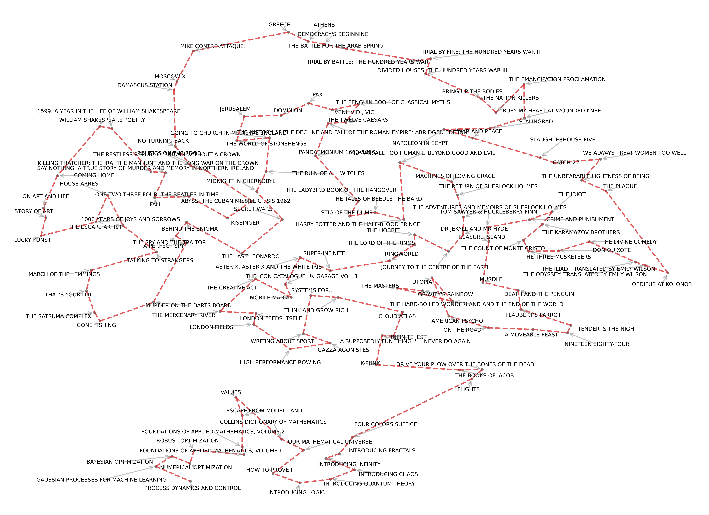

# `optimal-bookshelf`

<p align="center">

</p>


A terminal-based, machine learning enhanced book management system.

Track reading progress, manage your collection, and discover optimal shelf layouts through the semantic relationships between books.

## Features

- Add books via Google Books API search
- Add specific edition, or edit information
- Track reading status (Unread, In Progress, Finished)
- Interactive scrolling view or view overall bookshelf
- Generate semantic embeddings of your library using the latest OpenAI models (requires API key)
- Create optimal reading paths using TSP algorithms.
- Visualize book relationships in 2D space

## Installation
1. Install uv (reccomended over pip):
```
$ curl -LsSf https://astral.sh/uv/install.sh | sh
```

2. Install the project:
```
$ git clone https://github.com/trsav/bookshelf.git
$ cd bookshelf
```

3. Create virtual environment and install dependencies
```
$ uv venv
$ source .venv/bin/activate  # On Windows: .venv\Scripts\activate
# uv pip install -r requirements.txt
```

4. Add to your .bashrc or .zshrc for easier access
```
$ echo 'alias books="cd /path/to/bookshelf && source .venv/bin/activate && python cli.py"' >> ~/.bashrc
$ source ~/.bashrc
```

5. Create a `.env` file and add an `OPENAI_API_KEY`if you want to use the `embed` and `tsp` commands. i.e. 

```
OPENAI_API_KEY=sk-proj-....
```

Now you can just type `bookshelf scroll` or `bookshelf add` from anywhere.

## Usage
```
books add       # Add new books
books view      # View library
books scroll    # Interactive scroll view
books edit      # Edit books in library
books embed     # Create embeddings for optimal organization
books tsp       # Generate optimal reading path
books tsp -v    # Visualize reading path in 2D
```

## Optimal Organization
The `embed` command creates semantic embeddings for your books using descriptions and metadata. 
These embeddings capture relationships between books based on their content and themes.
The `tsp` command uses these embeddings to create an optimal reading path through your library:

Default mode finds a path in the full semantic space
Visual mode (`-v`) projects books into 2D space and generates a visualization
Both modes save the recommended reading order

Run embed after adding new books to ensure your optimal paths include your entire library.

<p align="center">

</p>

### About
Created by Tom Savage for no real reason.
The project is open-source and contributions are welcome.

